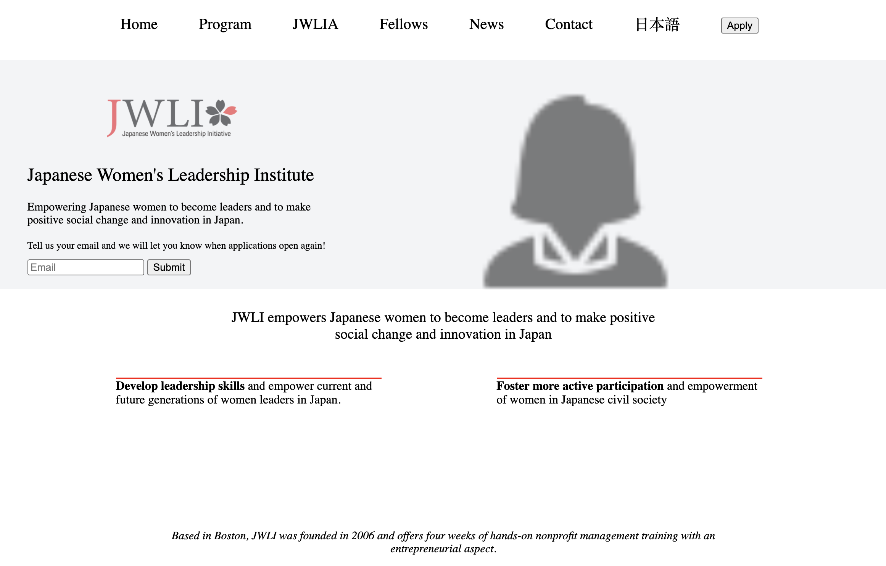

# JWLI

<i>Recreate a <strong>responsive</strong> site of JWLI using HTML and CSS</i>

<strong>How It's Made</strong>

The reference for this/aka the original site, had a lot of material. So in order to recreate it and make it
as near to "pixel-perfect" as I could, I first laid out the wireframe for each section that I drew out
on a separate "paint" tool. Sectioning each bit of the page to make for a cleaner and more effecient code when
stylizing.

When making the page responsive, I took out big "unnecessary" chunks of texts as the screen would get smaller.
For easier accessibility of potential mobile users, a big crowd of text or buttons is not what anyone wants-
and it definitely would not look pretty. Minimalistic for mobile, and allowing more information at once in a bigger
makes for a much better UX.

<strong>Lessons Learned</strong>

Even though it may seem like you are taking out big crucial pieces of information out
when formatting sites for smaller media queries (like mobile), I just focused on making it 
look friendly on the eyes. Although this project wasn't meant to be functioning- if I were to
do so, there would be a dropdown (hamburger), or an image flip which would display the text (like a card)
for those separate areas of text for the user to click
on specifically if that's what they would like to see or read- therefore it is their choice
whether or not the text appears on the screen.
The lesson here was to learn how to properly do media queries, and not make a site look crowded as your screen becomes smaller.
<i>"Would you trust this site enough to put credit card information in?"</i> is a good hypothetical to follow in such a case.
